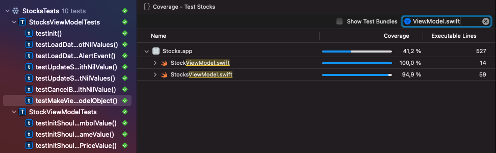

# Stocks

| Light Mode                     | Dark Mode                    |
| ------------------------------ | ---------------------------- |
|  |  |


| Unit tests                    |
| ----------------------------- |
|  |

### Initial Build Setup for iOS App

- Clone the project.

- Xcode 13 installed.

- iOS 15 or above.

- Carthage v0.38.0 installed.

- Swift Lint v0.44.0 installed.

- Open a tab on the terminal, go to the inside Stocks folder where Carfile is located, and run:

  ```
  carthage bootstrap --platform iOS --use-xcframeworks
  ```

- Open `Stocks.xcodeproj`.

- In Xcode, select a device.

- Build & Run.

### Architecture

- MVVM
- Factory Pattern
- Repository Pattern
- Delegate Pattern
- Protocol oriented programming

### API

* [API](https://myibd.investors.com/searchapi/predictivesearch/a/10/)

* Keys in the JSON are in the upper case. I think it should be lower case.

  ```json
  // upper case key
  "Symbol": "A",
  // lower case key
  "symbol": "A",
  ```

  